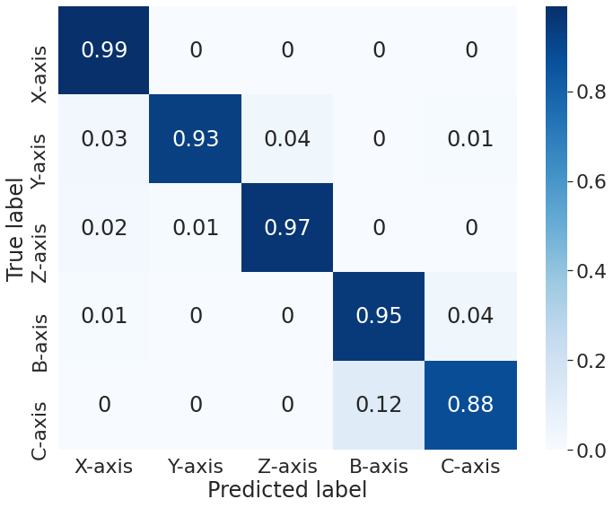
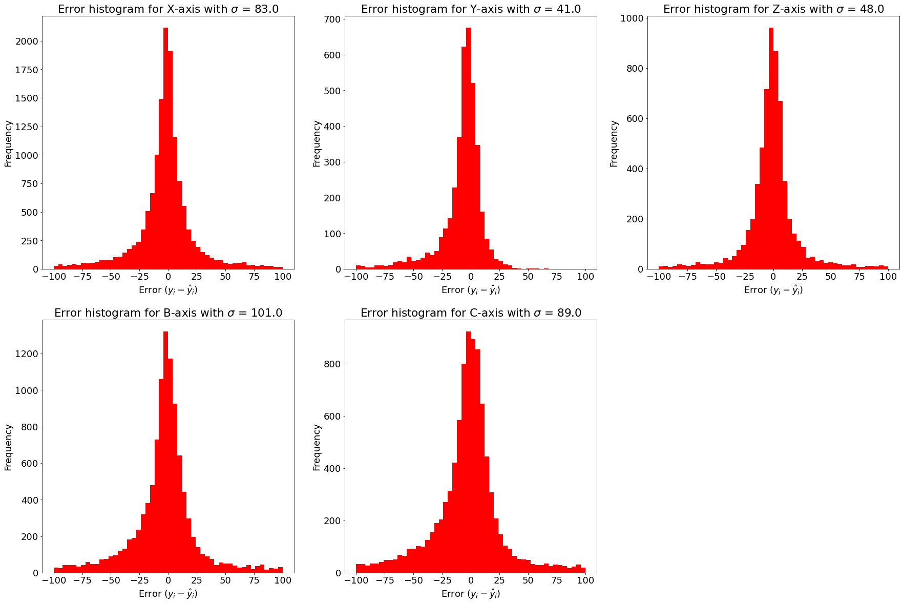

# Trained model weights

## Directories

- "training_history" -> Contains the training history information as a python dictionary and is pickled
- "multi-output_KFold-*_model.h5" -> Trained weights of the multi-output model for each of the cross validation folds

## Training information

- The very first model developed
- No oversampling was done before training
- The support for each axis
	- X -> 15090
	- Y -> 4247
	- Z -> 6570
	- B -> 11373
	- C -> 11364

## Model Evaluation

1. The confusion matrix. 

 

2. Feed rate prediction bar charts

 