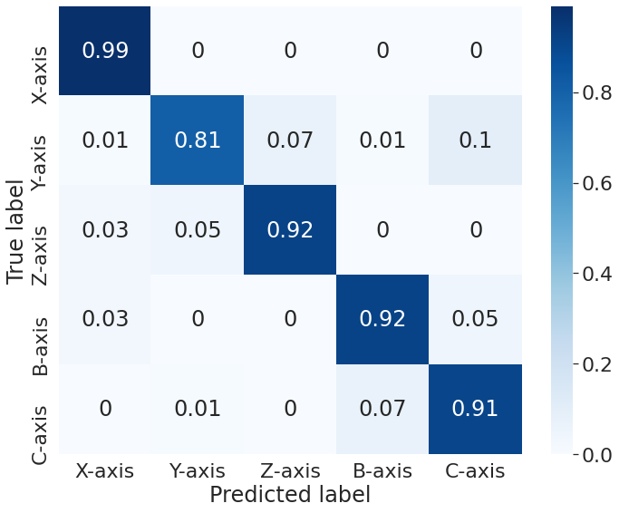
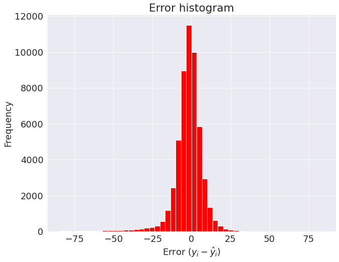

# Trained model weights

## Directories

- "training_history" -> Contains the training history information as a python dictionary and is pickled
- "multi-output_KFold-*_model.h5" -> Trained weights of the multi-output model for each of the cross validation folds

## Training information

- The random oversampling was applied before the model was developed
  - The oversampling was applied after conducting multiple experiments (2 for now) at the Y-axis
- The idea is to see the impact of multiple experiments for the Y-axis after random oversampling being applied
- The support for each axis
    - X -> 15090
    - Y -> 15090
    - Z -> 15090
    - B -> 15090
    - C -> 15090

## Model Evaluation

1. The confusion matrix. 

 

2. Feed rate prediction bar charts

